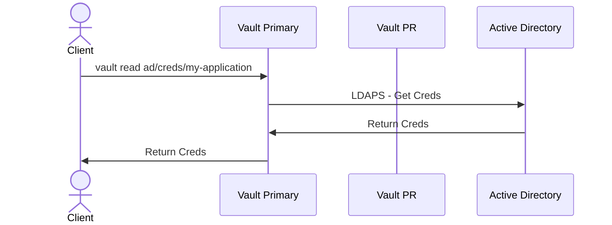
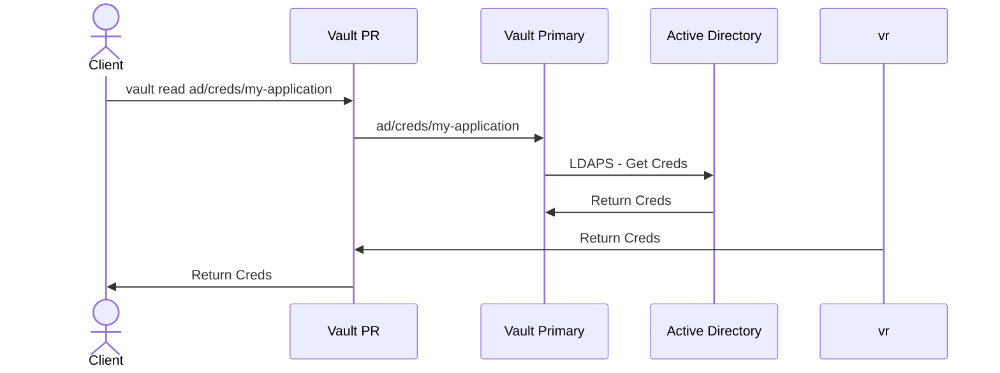

# vault-pr-ad-testing
Testing details on the AD Engine using PR's

## Setup Lab Infrastructure
We will use AWS for AD and our 2 VMs, one for Vault Primary and Vault PR, and set this up using Terraform.

### Create TF Vars
```bash
python3 setup-tfvars.py --username tyadmin --password random --domain_name tyler.home --ami_id ami-07b63a0cdc48e61fb --pem_path "~/.ssh/id_rsa" --pub_path "~/.ssh/id_rsa.pub"
```

### Run Terraform
```bash
cd tf
terraform init
terraform apply
```

## Setup Vault

### Copy License File
**Change license file to point at your vault.hclic**
```bash
scp vault.hclic ubuntu@[VAULT_SERVER]:
```

### Copy the config files over
This copies over the template for Vault and a Python script used to update it.
```bash
scp vault.hcl ubuntu@[VAULT_SERVER]:
scp setup-vault.py ubuntu@[VAULT_SERVER]:
```

```bash
scp setup-vault.py ubuntu@3.67.148.6:
scp setup-vault.py ubuntu@3.79.90.4:
```

### Install Vault
**Do this for both the servers**

```bash
ssh ubuntu@[VAULT_SERVER]

## Install Vault
sudo apt update && sudo apt install gpg
wget -O- https://apt.releases.hashicorp.com/gpg | sudo gpg --dearmor -o /usr/share/keyrings/hashicorp-archive-keyring.gpg
gpg --no-default-keyring --keyring /usr/share/keyrings/hashicorp-archive-keyring.gpg --fingerprint
echo "deb [arch=$(dpkg --print-architecture) signed-by=/usr/share/keyrings/hashicorp-archive-keyring.gpg] https://apt.releases.hashicorp.com $(lsb_release -cs) main" | sudo tee /etc/apt/sources.list.d/hashicorp.list
sudo apt update
sudo apt install vault-enterprise
sudo cp ~/vault.hclic /etc/vault.d/
sudo cp ~/vault.hcl /etc/vault.d/vault.hcl
sudo python3 ~/setup-vault.py

## Start Vault
sudo systemctl enable vault.service
sudo systemctl start vault

## Setup Vault
export VAULT_ADDR="http://127.0.0.1:8200"
vault status
vault operator init
vault operator unseal
vault operator unseal
vault operator unseal
```

### Setup PR on Primary
**Remember to change the password** when creating the tester user. Also, take note of the secondary token generated here.
```bash
ssh ubuntu@[VAULT_PRIMARY_SERVER]

export VAULT_ADDR="http://127.0.0.1:8200"
vault login

vault policy write superuser -<<EOF
path "*" {
  capabilities = ["create", "read", "update", "delete", "list", "sudo"]
}
EOF
vault auth enable userpass
vault write auth/userpass/users/tester password="changeme" policies="superuser"
vault write -f sys/replication/performance/primary/enable

vault write sys/replication/performance/primary/secondary-token id=PR
```

### Set up PR on PR
Replace `<token>` with the step above's secondary token. You also need to replace `<primary_IP_addr>` with the primary's IP address.
```bash
ssh ubuntu@[VAULT_PR_SERVER]

export VAULT_ADDR="http://127.0.0.1:8200"
vault login

vault write sys/replication/performance/secondary/enable token=<token>
```

## Testing AD With the PRs

### AD Setup
For this I went through the following [guide](https://wiki.articatech.com/en/active-directory/active-directory-ldap-ssl-windows-2022) on the windows server

### Overview and Setup
Note: The Active Directory (AD) secrets engine has been deprecated as of the Vault 1.13 release. We will continue to support the AD secrets engine in maintenance mode for six major Vault releases. Maintenance mode means that we will fix bugs and security issues but will not add new features. For additional information, see the deprecation table and migration guide.

**On Primary** Since its recomended to make all writes to the primary thats how I'm going to start. Ensure you update the `<ldap_username>`, `<ldap_password>` & `<ldap_url>` during the first 3 exports. 

```bash
export USERNAME=<ldap_username>
export PASSWORD=<ldap_password>
export LDAP_URL=<ldap_url>

vault secrets enable ad

vault write ad/config \
    binddn=$USERNAME \
    bindpass=$PASSWORD \
    url=ldaps://$LDAP_URL \
    insecure_tls=true \
    userdn='dc=tyler,dc=home'

vault write ad/roles/my-application \
    service_account_name="my-application@tyler.home" insecure_tls=true

vault read ad/roles/my-application
```

### Testing getting creds on primary

```bash
vault read ad/creds/my-application
```

Using TCP dump I can see the traffic flow during this are as follows. This goes from the primary to the AD server


### Testing getting creds on PR

```bash
vault read ad/creds/my-application
```

In this case we see the same thing if the PR is alive, traffic goes from the primary



### Testing getting creds on PR with Primary down

Primary:

```bash
sudo systemctl stop vault
```

PR:
```bash
vault read ad/creds/my-application
```

This returned the following error

```text
Error reading ad/creds/my-application: Error making API request.

URL: GET http://127.0.0.1:8200/v1/ad/creds/my-application
Code: 500. Errors:

* 1 error occurred:
	* request error returned from primary: rpc error: code = Unavailable desc = connection error: desc = "transport: Error while dialing: dial tcp 172.31.46.225:8201: connect: connection refused"
```

### Quick Testing getting creds on primary
```bash
vault write ad/library/accounting-team \
    service_account_names=my-application@tyler.home \
    ttl=30s \
    max_ttl=20h \
    disable_check_in_enforcement=false

vault read ad/library/accounting-team/status

vault write -f ad/library/accounting-team/check-out
vault write -f ad/library/accounting-team/check-in
```