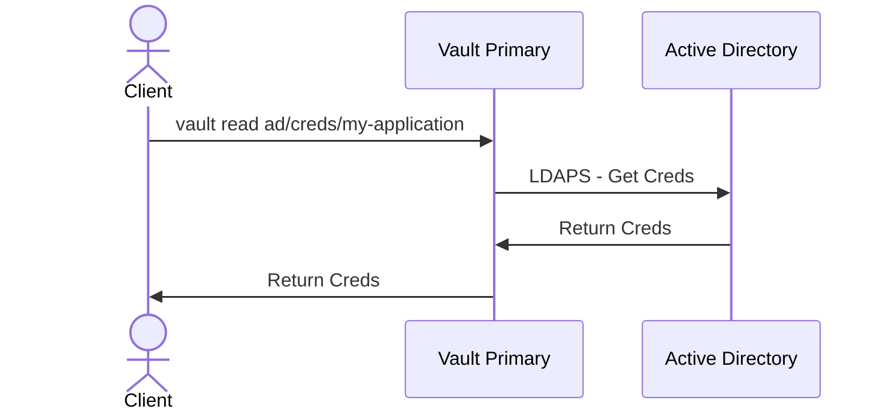
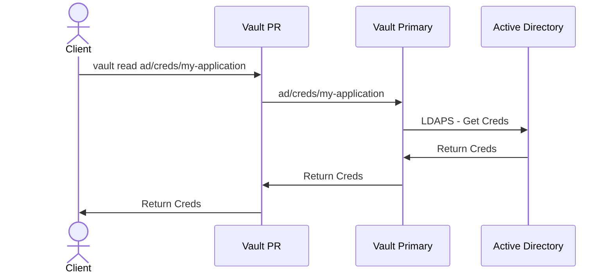
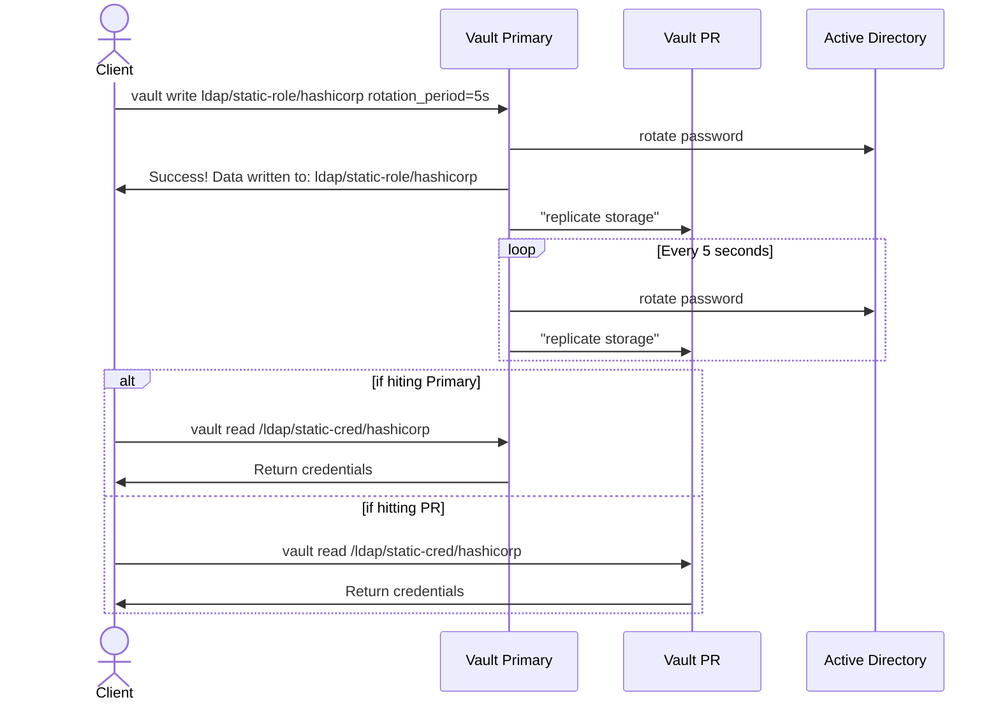

# vault-pr-ad-testing
In this document, we will detail the process of setting up and testing the AD Engine using PRs (Performance Replication) in HashiCorp Vault. This includes setting up the lab infrastructure, configuring Vault, and testing various scenarios.

## Setup Lab Infrastructure
We will use AWS for the Active Directory (AD) and two virtual machines (VMs) - one for Vault Primary and one for Vault PR. We will set up this infrastructure using Terraform.

### Create Terraform Variables
```bash
python3 setup-tfvars.py --username tyadmin --password random --domain_name tyler.home --ami_id ami-07b63a0cdc48e61fb --pem_path "~/.ssh/id_rsa" --pub_path "~/.ssh/id_rsa.pub"
```

### Run Terraform
```bash
cd tf
terraform init
terraform apply
```

## Setup Vault
Before using Vault, we need to configure and set it up properly.

### Copy License File
Change the license file to point to your `vault.hclic` file.

```bash
scp vault.hclic ubuntu@[VAULT_SERVER]:
```

### Copy Configuration Files
Copy the Vault configuration files, including the template for Vault and a Python script used to update it.

```bash
scp vault.hcl ubuntu@[VAULT_SERVER]:
scp setup-vault.py ubuntu@[VAULT_SERVER]:
```

Then, replicate these files to the PR server as well.

```bash
scp setup-vault.py ubuntu@3.67.148.6:
scp setup-vault.py ubuntu@3.79.90.4:
```

### Install Vault
Install Vault on both the primary and PR servers. Follow these steps for each server.

```bash
ssh ubuntu@[VAULT_SERVER]

# Install Vault
sudo apt update && sudo apt install gpg
wget -O- https://apt.releases.hashicorp.com/gpg | sudo gpg --dearmor -o /usr/share/keyrings/hashicorp-archive-keyring.gpg
gpg --no-default-keyring --keyring /usr/share/keyrings/hashicorp-archive-keyring.gpg --fingerprint
echo "deb [arch=$(dpkg --print-architecture) signed-by=/usr/share/keyrings/hashicorp-archive-keyring.gpg] https://apt.releases.hashicorp.com $(lsb_release -cs) main" | sudo tee /etc/apt/sources.list.d/hashicorp.list
sudo apt update
sudo apt install vault-enterprise
sudo cp ~/vault.hclic /etc/vault.d/
sudo cp ~/vault.hcl /etc/vault.d/vault.hcl
sudo python3 ~/setup-vault.py

# Start Vault
sudo systemctl enable vault.service
sudo systemctl start vault

# Setup Vault
export VAULT_ADDR="http://127.0.0.1:8200"
vault status
vault operator init
vault operator unseal
vault operator unseal
vault operator unseal
```

### Setup PR on Primary
Make sure to change the password when creating the tester user. Also, take note of the secondary token generated here.

```bash
ssh ubuntu@[VAULT_PRIMARY_SERVER]

export VAULT_ADDR="http://127.0.0.1:8200"
vault login

vault policy write superuser -<<EOF
path "*" {
  capabilities = ["create", "read", "update", "delete", "list", "sudo"]
}
EOF
vault auth enable userpass
vault write auth/userpass/users/tester password="changeme" policies="superuser"
vault write -f sys/replication/performance/primary/enable

vault write sys/replication/performance/primary/secondary-token id=PR
```

### Set up PR on PR
Replace `<token>` with the secondary token generated in the previous step. Also, replace `<primary_IP_addr>` with the primary's IP address.

```bash
ssh ubuntu@[VAULT_PR_SERVER]

export VAULT_ADDR="http://127.0.0.1:8200"
vault login

vault write sys/replication/performance/secondary/enable token=<token>
```

## Testing AD With the PRs

### AD Setup
For this, we followed the guide available at [this link](https://wiki.articatech.com/en/active-directory/active-directory-ldap-ssl-windows-2022) on the Windows server.

### Overview and Setup
It's important to note that the Active Directory (AD) secrets engine has been deprecated as of Vault 1.13. It will continue to be supported in maintenance mode for six major Vault releases. Maintenance mode means that it will receive bug fixes and security updates but no new features. Refer to the deprecation table and migration guide for additional information.

**On Primary:** To start, it is recommended to make all writes to the primary. Make sure to update the `<ldap_username>`, `<ldap_password>`, and `<ldap_url>` during the first 3 exports.

```bash
export USERNAME=<ldap_username>
export PASSWORD=<ldap_password>
export LDAP_URL=<ldap_url>

vault secrets enable ad

vault write ad/config \
    binddn=$USERNAME \
    bindpass=$PASSWORD \
    url=ldaps://$LDAP_URL \
    insecure_tls=true \
    userdn='dc=tyler,dc=home'

vault write ad/roles/my-application \
    service_account_name="my-application@tyler.home" insecure_tls=true

vault read ad/roles/my-application
```

### Testing Getting Credentials on Primary

```bash
vault read ad/creds/my-application
```

Using TCP dump, we can observe the traffic flow during this operation, which goes from the primary to the AD server.



### Testing Getting Credentials on PR

```bash
vault read ad/creds/my-application
```

In this case, we observe the same flow if the PR is operational; traffic goes from the primary.



### Testing Getting Credentials on PR with Primary Down

If the primary server is down:

Primary:

```bash
sudo systemctl stop vault
```

PR:

```bash
vault read ad/creds/my-application
```

This results in the following error:

```text
Error reading ad/creds/my-application: Error making API request.

URL: GET http://127.0.0.1:8200/v1/ad/creds/my-application
Code: 500. Errors:

* 1 error occurred:
	* request error returned from primary: rpc error: code = Unavailable desc = connection error: desc = "transport: Error while dialing: dial tcp 172.31.46.225:8201: connect: connection refused"
```

## LDAP Secrets Engine

### Testing with Static Credentials

The command `vault read /ldap/static-cred/hashicorp` works on the PR even when the Primary is down. However, the TTL will not get renewed.

```bash
vault secrets enable ldap

vault write ldap/config \
    binddn=$USERNAME \
    bindpass=$PASSWORD \
    url=ldaps://$LDAP_URL \
    insecure_tls=true \
    schema=ad \
    password_policy=example

vault write ldap/static-role/hashicorp \
    dn="CN=hashicorp hashicorp,CN=Users,DC=tyler,DC=home" \
    username='hashicorp' \
    rotation_period="5s"

vault read /ldap/static-cred/hashicorp
```



This comprehensive document outlines the steps for setting up and testing the AD Engine using PRs, with detailed explanations and diagrams for various scenarios.